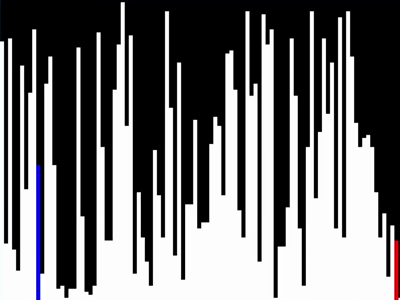
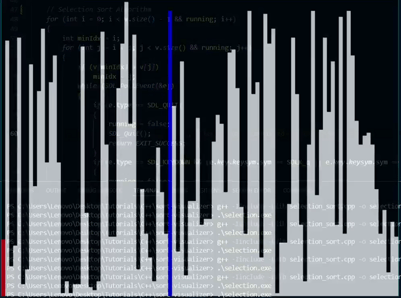
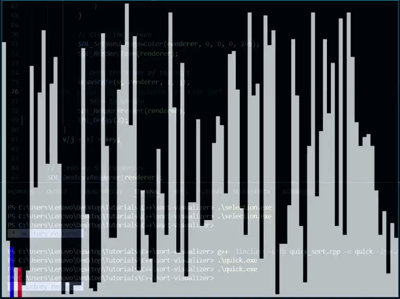
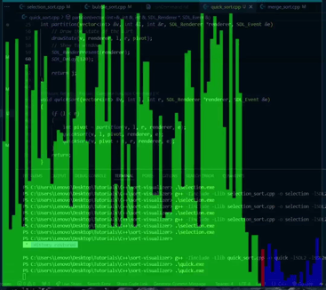
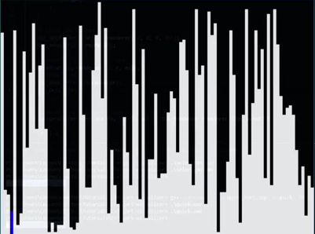

# Sorting Algorithm Visualizer

This project is a visualizer for several popular sorting algorithms using **C++** and **SDL2**. It demonstrates the sorting process step by step, helping to visualize how each algorithm operates. The following sorting algorithms are included:

- [Bubble Sort](#bubble-sort)
- [Selection Sort](#selection-sort)
- [Insertion Sort](#insertion-sort)
- [Quick Sort](#quick-sort)
- [Merge Sort](#merge-sort)

## How to Run

1. Clone this repository.
2. Install the required dependencies (SDL2).
3. Compile and run the project.

### Compilation Command:
```bash
g++ -o sort_visualizer main.cpp -lSDL2 -lSDL2_ttf
```

## Sorting Algorithms
### 1. Bubble Sort
- **Description**: Bubble Sort repeatedly steps through the list, compares adjacent elements, and swaps them if they are in the wrong order. The pass through the list is repeated until the list is sorted.
- **Time Complexity**: 
  - Best: $$O(n)$$
  - Average: $$O(n^2)$$
  - Worst: $$O(n^2)$$
- **Space Complexity**: $$O(1)$$



### 2. Selection Sort
- **Description**: Selection Sort divides the input list into two parts: a sorted part and an unsorted part. It repeatedly selects the smallest (or largest) element from the unsorted part and moves it to the end of the sorted part.
- **Time Complexity**:
  - Best: $$O(n^2)$$
  - Average: $$O(n^2)$$
  - Worst: $$O(n^2)$$
- **Space Complexity**: $$O(1)$$



### 3. Insertion Sort
- **Description**: Insertion Sort builds a sorted array one element at a time by repeatedly taking the next element from the input data and inserting it into the correct position in the already sorted part.
- **Time Complexity**:
  - Best: $$O(n)$$
  - Average: $$O(n^2)$$
  - Worst: $$O(n^2)$$
- **Space Complexity**: $$O(1)$$



### 4. Quick Sort
- **Description**: Quick Sort is a divide-and-conquer algorithm that works by selecting a 'pivot' element from the array and partitioning the other elements into two sub-arrays according to whether they are less than or greater than the pivot.
- **Time Complexity**:
  - Best: $$O(n \log n)$$
  - Average: $$O(n \log n)$$
  - Worst: $$O(n^2)$$
- **Space Complexity**: $$O(\log n)$$ (due to recursion stack)



### Merge Sort
- **Description**: Merge Sort is another divide-and-conquer algorithm that divides the input array into two halves, sorts them, and then merges them back together.
- **Time Complexity**:
  - Best: $$O(n \log n)$$
  - Average: $$O(n \log n)$$
  - Worst: $$O(n \log n)$$
- **Space Complexity**: $$O(n)$$


